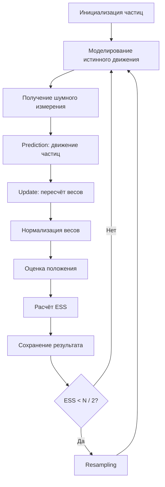

# Particle Filter на C

Проект, демонстрирующий работу **Particle Filter** — фильтра частиц для оценки положения объекта по шумным измерениям.

Изначально программа моделировала одномерное движение объекта, получала неточные данные от сенсора и с помощью множества частиц постепенно оценивала истинное положение объекта.

После доработки проект также поддерживает **трёхмерное пространство**. В 3D-версии объект имеет координаты `x`, `y`, `z`, а фильтр оценивает положение объекта сразу по трём осям.

## Что делает проект

- моделирует реальное движение объекта;
- добавляет шум движения и шум измерения;
- создаёт набор частиц — гипотез о положении объекта;
- обновляет веса частиц на основе нового измерения;
- нормализует веса;
- вычисляет оценку положения как взвешенное среднее;
- применяет ресэмплинг при вырождении частиц;
- считает ESS, доверительный интервал и RMSE;
- сохраняет результаты симуляции в CSV-файлы;
- строит визуализацию для одномерного и трёхмерного вариантов.

В 3D-версии каждая частица хранит не одну координату, а три:

```text
x, y, z
```

Также для prediction используется не простое прибавление скорости, а **экспоненциальное среднее скорости**.

## Как работает Particle Filter

Фильтр частиц хранит много возможных вариантов положения объекта. Каждый такой вариант называется **частицей**.

На каждом шаге алгоритм выполняет несколько этапов:

1. **Prediction** — частицы сдвигаются по модели движения.
2. **Measurement update** — каждая частица получает вес в зависимости от близости к измерению сенсора.
3. **Normalization** — веса приводятся к сумме 1.
4. **Estimation** — итоговая позиция считается как взвешенное среднее частиц.
5. **ESS** — вычисляется эффективное количество полезных частиц.
6. **Resampling** — если эффективное число частиц становится маленьким, слабые частицы заменяются копиями более вероятных.



Важно: в 3D-версии частицы сохраняются в CSV **до ресэмплинга**. Это сделано для визуализации, чтобы в файл попали настоящие веса частиц после обновления по измерению.

После ресэмплинга веса снова становятся одинаковыми:

```text
weight = 1.0 / N
```

Поэтому если сохранять частицы после ресэмплинга, цветовая шкала весов на графике становится почти бесполезной.

## Prediction через экспоненциальное среднее

В простой версии prediction можно было представить так:

```text
новая позиция = старая позиция + скорость + шум
```

Но такой подход слишком грубый, потому что скорость просто прибавляется как постоянная величина.

В доработанной версии используется **экспоненциальное среднее скорости**:

```text
smoothed_velocity = alpha * instant_velocity + (1 - alpha) * smoothed_velocity
```

где:

- `instant_velocity` — мгновенная скорость, найденная как разница между текущей и прошлой оценкой;
- `smoothed_velocity` — сглаженная скорость;
- `alpha` — коэффициент сглаживания.

В 3D-версии скорость сглаживается отдельно по каждой оси:

```c
smoothed_vx = alpha * instant_vx + (1.0 - alpha) * smoothed_vx;
smoothed_vy = alpha * instant_vy + (1.0 - alpha) * smoothed_vy;
smoothed_vz = alpha * instant_vz + (1.0 - alpha) * smoothed_vz;
```

Затем prediction использует эти сглаженные скорости:

```c
particles[i].x += smoothed_vx + rand_normal(0, sqrt(Q));
particles[i].y += smoothed_vy + rand_normal(0, sqrt(Q));
particles[i].z += smoothed_vz + rand_normal(0, sqrt(Q));
```

В проекте используется коэффициент:

```c
double alpha = 0.2;
```

Чем меньше `alpha`, тем плавнее меняется скорость.  
Чем больше `alpha`, тем быстрее фильтр реагирует на новые изменения, но оценка может становиться более резкой.

## Визуализация результата

## 1D-график на плоскости

Ниже показан пример работы одномерной версии программы после запуска симуляции.

Это график на плоскости, но сам фильтр здесь остаётся **одномерным**:

- по горизонтальной оси показан номер шага;
- по вертикальной оси показано положение объекта.

На графике сравниваются три линии:

- **True Position** — истинное положение объекта;
- **Measurement** — шумное измерение сенсора;
- **Estimate (Particle Filter)** — оценка положения, полученная фильтром частиц.

График показывает, что оценка Particle Filter обычно идёт ближе к истинной траектории, чем шумные измерения. Это означает, что фильтр уменьшает влияние случайного шума и даёт более устойчивую оценку положения объекта.


## 3D-визуализация частиц

Дополнительно проект строит 3D-график для трёхмерной версии Particle Filter.

В этой версии объект движется в пространстве и имеет три координаты:

```text
x, y, z
```

На графике используются три пространственные оси:

- **X position** — координата объекта по оси X;
- **Y position** — координата объекта по оси Y;
- **Z position** — координата объекта по оси Z.

На 3D-графике отображаются:

- **True trajectory** — истинная траектория объекта;
- **Measurements** — шумные измерения сенсора;
- **Estimated trajectory** — траектория, оценённая Particle Filter;
- **Particles** — частицы на последнем шаге симуляции;
- **Start** — начальная точка движения;
- **End** — конечная точка движения.

Каждая точка облака частиц — это отдельная гипотеза о положении объекта в 3D-пространстве.

Цвет точки отражает нормализованный вес частицы:

- тёмные точки соответствуют частицам с маленьким весом;
- светлые точки соответствуют частицам с большим весом;
- самые яркие точки показывают частицы, которые сильнее всего влияют на итоговую оценку фильтра.

Размер точки также может зависеть от веса: чем больше вес, тем крупнее частица.

Линия **Measurements** обычно заметнее отклоняется от истинной траектории, потому что содержит случайный шум.  
Линия **Estimated trajectory** должна идти ближе к **True trajectory**, так как фильтр использует множество частиц и их веса, чтобы сгладить шум измерений.

Облако частиц в конце траектории показывает, где фильтр считает объект наиболее вероятно находящимся на последнем шаге. Если частицы концентрируются рядом с истинной траекторией, значит фильтр успешно отслеживает объект.

Такой график помогает увидеть внутреннюю работу алгоритма:

- как частицы распределяются по возможным положениям;
- какие частицы становятся наиболее вероятными;
- как веса меняются после сравнения с измерением;
- как фильтр постепенно уточняет оценку положения;
- почему ресэмплинг нужен для удаления слабых частиц и сохранения сильных гипотез.


## Коротко о терминах

Ниже — простое объяснение основных слов, которые встречаются в проекте и в выводе программы.

### Частица

**Частица** — это одна гипотеза о том, где может находиться объект.

В одномерной версии частица хранит одно значение:

```text
частица 1: x = 0.3
частица 2: x = 1.7
частица 3: x = -0.8
...
```

В трёхмерной версии частица хранит сразу три координаты:

```text
частица 1: x = 0.3, y = 1.2, z = -0.4
частица 2: x = 1.7, y = 0.9, z = 2.1
частица 3: x = -0.8, y = 2.4, z = 0.5
...
```

Чем больше частиц около настоящего положения, тем увереннее фильтр в своей оценке.

### Вес частицы

**Вес** показывает, насколько частица похожа на правду.

Если частица находится близко к измерению сенсора, её вес становится больше. Если далеко — меньше.

Пример для одномерного случая:

```text
измерение сенсора: 10.0

частица x = 9.8  -> большой вес
частица x = 10.4 -> большой вес
частица x = 2.0  -> маленький вес
```

В 3D-версии близость считается через расстояние между измерением и частицей:

```text
distance² = dx² + dy² + dz²
```

где:

```text
dx = meas_x - particle_x
dy = meas_y - particle_y
dz = meas_z - particle_z
```

После обновления весов программа выполняет **нормализацию**: все веса масштабируются так, чтобы их сумма была равна `1`.

### Шум

**Шум** — это случайная ошибка.

В реальных задачах объект почти никогда не движется идеально, а сенсор почти никогда не измеряет идеально. Поэтому в проекте есть два вида шума:

| Вид шума | Что означает |
|---|---|
| шум процесса | случайная ошибка в движении объекта или частиц |
| шум измерения | ошибка сенсора при измерении положения |

Например, если объект реально находится в точке `10`, сенсор может показать `8.7`, `10.4` или `12.1`.

В 3D-версии шум добавляется отдельно по каждой координате:

```text
x = true_x + noise_x
y = true_y + noise_y
z = true_z + noise_z
```

### Дисперсия

**Дисперсия** показывает, насколько сильно значения разбросаны вокруг среднего.

Маленькая дисперсия означает, что значения находятся близко друг к другу:

```text
9.8, 10.0, 10.1, 10.2
```

Большая дисперсия означает, что значения сильно разбросаны:

```text
3.0, 8.0, 10.0, 15.0, 22.0
```

В этом проекте дисперсия используется для описания силы шума.

```c
double R = 4.0;
```

`R` — это дисперсия шума измерения. Чем больше `R`, тем менее точным считается сенсор.

В коде также используется `Q` — дисперсия шума процесса. Она влияет на то, насколько сильно частицы могут случайно отклоняться при движении.

Важно: стандартное отклонение — это корень из дисперсии.

```text
standard deviation = sqrt(variance)
```

Поэтому если `R = 4.0`, то стандартное отклонение шума измерения равно:

```text
sqrt(4.0) = 2.0
```

### Prediction

**Prediction** — шаг предсказания.

На этом этапе фильтр двигает каждую частицу по модели движения.

В простой форме:

```text
новая позиция = старая позиция + скорость + случайный шум
```

В доработанной версии скорость берётся из экспоненциального среднего. Это делает prediction более плавным и менее зависимым от случайных скачков оценки.

В 3D-версии prediction выполняется отдельно по каждой координате:

```text
new_x = old_x + smoothed_vx + noise_x
new_y = old_y + smoothed_vy + noise_y
new_z = old_z + smoothed_vz + noise_z
```

### Экспоненциальное среднее

**Экспоненциальное среднее** используется для сглаживания скорости.

Обычная мгновенная скорость может сильно прыгать из-за шума измерений. Поэтому программа не использует её напрямую, а смешивает новую скорость со старой сглаженной скоростью:

```text
smoothed_velocity = alpha * instant_velocity + (1 - alpha) * smoothed_velocity
```

Если `alpha` маленький, скорость меняется плавнее.  
Если `alpha` большой, скорость быстрее реагирует на новые данные.

В 3D-версии это делается отдельно для `x`, `y`, `z`.

### Measurement update

**Measurement update** — шаг обновления по измерению.

После получения измерения сенсора программа сравнивает каждую частицу с этим измерением. Частицы, которые оказались ближе к измерению, получают больший вес.

Идея простая:

```text
частица близко к измерению -> вес увеличивается
частица далеко от измерения -> вес уменьшается
```

В 3D-версии сравнение идёт не по одной координате, а по расстоянию в пространстве.

### ESS

**ESS** расшифровывается как **Effective Sample Size**, то есть эффективный размер выборки.

Он показывает, сколько частиц реально полезны.

Например, всего может быть `500` частиц, но если почти весь вес сосредоточен у нескольких частиц, то остальные почти не влияют на результат. В таком случае ESS становится маленьким.

Примерная интерпретация:

| ESS | Что означает |
|---:|---|
| близко к `N` | веса распределены хорошо, много полезных частиц |
| сильно меньше `N` | большая часть частиц почти бесполезна |
| меньше `N / 2` | в этом проекте запускается ресэмплинг |

### Вырождение частиц

**Вырождение частиц** — ситуация, когда большинство частиц имеет почти нулевой вес.

Формально частицы ещё существуют, но практически результат определяют только несколько из них. Это плохо, потому что фильтр теряет разнообразие гипотез.

Именно для борьбы с этим используется ресэмплинг.

### Ресэмплинг

**Ресэмплинг** — это пересборка набора частиц на основе их весов.

Частицы с большими весами с большей вероятностью копируются. Частицы с маленькими весами чаще исчезают.

Упрощённо:

```text
до ресэмплинга:
A: большой вес
B: маленький вес
C: большой вес
D: почти нулевой вес

после ресэмплинга:
A, A, C, C
```

После ресэмплинга веса снова становятся равными:

```text
weight = 1.0 / N
```

В этом проекте используется **систематический ресэмплинг**. Он не выбирает каждую новую частицу полностью независимо, а проходит по распределению весов с равномерным шагом. Такой метод обычно стабильнее простого случайного выбора.

Для визуализации частицы сохраняются в файл **до ресэмплинга**, чтобы на графике были видны настоящие веса после обновления по измерению.

### Оценка положения

**Оценка положения** — итоговый ответ фильтра на вопрос: «где, скорее всего, находится объект?»

В одномерной версии она считается как взвешенное среднее:

```text
estimate = сумма(x частицы * вес частицы)
```

В 3D-версии оценка считается отдельно по каждой координате:

```text
est_x = сумма(x частицы * вес частицы)
est_y = сумма(y частицы * вес частицы)
est_z = сумма(z частицы * вес частицы)
```

Частицы с большим весом сильнее влияют на итоговую оценку.

### Доверительный интервал

**Доверительный интервал** показывает примерную область, где может находиться объект с учётом разброса частиц.

В проекте он считается приближённо:

```text
mean ± 1.96 * std
```

где:

- `mean` — среднее положение частиц;
- `std` — стандартное отклонение;
- `1.96` — коэффициент для 95% доверительного интервала при нормальном распределении.

Раньше часто используют грубое приближение:

```text
mean ± 2 * std
```

Но для 95% доверительного интервала точнее использовать именно:

```text
mean ± 1.96 * std
```

В 3D-версии доверительный интервал считается отдельно для каждой координаты:

```text
X: [ci_low_x, ci_high_x]
Y: [ci_low_y, ci_high_y]
Z: [ci_low_z, ci_high_z]
```

Это не строгая математическая гарантия, а удобная учебная оценка неопределённости.

### RMSE

**RMSE** — среднеквадратичная ошибка.

Она показывает, насколько сильно оценка фильтра в среднем отличается от истинного положения объекта.

Меньше RMSE — лучше работа фильтра.

Пример для одномерного случая:

```text
истинное положение: 10.0
оценка фильтра:     11.5
ошибка:              1.5
```

В 3D-версии ошибка считается как расстояние между истинной точкой и оценкой:

```text
error = sqrt((true_x - est_x)^2 + (true_y - est_y)^2 + (true_z - est_z)^2)
```

RMSE считается по ошибкам за все шаги симуляции.

## Структура проекта

```text
.
├── Particle.c
├── README.md
├── output.csv
├── particles.csv
├── output3D.csv
├── particles3D.csv
├── visualize_1d.py
├── visualize_3d.py
└── images/
    ├── particle_filter_visualization.png
    └── particle_filter_3d.png
```

## Требования

Для сборки нужен C-компилятор с поддержкой стандартной библиотеки C. В программе используются стандартные заголовочные файлы `stdio.h`, `stdlib.h`, `time.h` и математический заголовок `math.h`.

Подойдут:

- GCC;
- Clang;
- MinGW на Windows.

Для визуализации нужны Python-библиотеки:

```bash
pip install pandas matplotlib
```

## Сборка и запуск

### Linux / macOS

```bash
gcc -Wall -Wextra -std=c11 Particle.c -lm -o particle_filter
./particle_filter
```

### Windows через MinGW

```bash
gcc -Wall -Wextra -std=c11 Particle.c -lm -o particle_filter.exe
particle_filter.exe
```

> Флаг `-lm` нужен для подключения математической библиотеки при сборке через GCC/Clang, потому что в программе используются `sqrt`, `log`, `cos`, `exp` и другие функции из `math.h`. Заголовки `stdio.h`, `stdlib.h` и `time.h` входят в стандартную библиотеку C и отдельного флага линковки обычно не требуют.

## Запуск визуализации

Для одномерного графика:

```bash
python visualize_1d.py
```

Для 3D-визуализации:

```bash
python visualize_3d.py
```

Перед запуском визуализации нужно сначала запустить C-программу, чтобы она создала CSV-файлы.

## Пример вывода для 1D-версии

После запуска одномерная версия программы печатает информацию по каждому шагу симуляции:

```text
=== Шаг 0 ===
Истинное: 0.422 | Измерение: -0.497 | Оценка: -0.551
Ошибка: 0.974 | ESS: 181.64 | Ресемплинг: ДА
Доверительный интервал 95%: [-4.43 , 3.36]
Разброс частиц: [-7.04 , 5.48]
```

В конце выводится итоговая ошибка фильтра:

```text
Среднеквадратичная ошибка (RMSE) = 1.2345
```

## Пример вывода для 3D-версии

В 3D-версии вывод содержит координаты по трём осям:

```text
=== Шаг 0 ===
Истинное: (1.156, 0.318, 0.742)
Измерение: (0.641, 2.104, -1.337)
Оценка: (0.829, 0.544, 0.106)
EMA velocity: (0.912, 0.423, 0.181)
Ошибка 3D: 0.748 | ESS: 136.52 | Ресемплинг: ДА
Доверительный интервал 95% X: [-2.15 , 3.81]
Доверительный интервал 95% Y: [-2.76 , 3.48]
Доверительный интервал 95% Z: [-3.11 , 2.92]
Разброс частиц X: [-5.21 , 6.03]
Разброс частиц Y: [-4.83 , 5.79]
Разброс частиц Z: [-5.02 , 4.88]
```

Так как в симуляции используется случайный шум, конкретные числа при каждом запуске будут отличаться.

## Выходные файлы

### `output.csv`

Файл содержит основные значения по каждому шагу для одномерной версии:

```csv
true,measurement,estimate
0.422471,-0.497456,-0.551295
1.861268,-1.950268,-1.001961
2.688552,6.181552,4.697656
```

Поля:

| Поле | Описание |
|---|---|
| `true` | истинное положение объекта |
| `measurement` | измерение сенсора с шумом |
| `estimate` | оценка положения, полученная фильтром частиц |

### `particles.csv`

Файл содержит состояние всех частиц на каждом шаге для одномерной версии:

```csv
step,x,weight
0,3.053928,0.002000
0,-3.970882,0.002000
0,-1.262968,0.002000
```

Поля:

| Поле | Описание |
|---|---|
| `step` | номер шага симуляции |
| `x` | положение частицы |
| `weight` | вес частицы |

### `output3D.csv`

Файл содержит основные значения по каждому шагу для 3D-версии:

```csv
step,true_x,true_y,true_z,meas_x,meas_y,meas_z,est_x,est_y,est_z,error,ess,ci_low_x,ci_high_x,ci_low_y,ci_high_y,ci_low_z,ci_high_z
0,1.156,0.318,0.742,0.641,2.104,-1.337,0.829,0.544,0.106,0.748,136.52,-2.15,3.81,-2.76,3.48,-3.11,2.92
```

Поля:

| Поле | Описание |
|---|---|
| `step` | номер шага симуляции |
| `true_x`, `true_y`, `true_z` | истинное положение объекта в 3D |
| `meas_x`, `meas_y`, `meas_z` | шумное измерение сенсора |
| `est_x`, `est_y`, `est_z` | оценка положения, полученная фильтром |
| `error` | ошибка в 3D как расстояние между истинной точкой и оценкой |
| `ess` | эффективный размер выборки |
| `ci_low_x`, `ci_high_x` | 95% доверительный интервал по X |
| `ci_low_y`, `ci_high_y` | 95% доверительный интервал по Y |
| `ci_low_z`, `ci_high_z` | 95% доверительный интервал по Z |

### `particles3D.csv`

Файл содержит состояние всех частиц на каждом шаге для 3D-версии:

```csv
step,x,y,z,weight
0,3.053928,-1.420813,0.842917,0.002000
0,-3.970882,2.153991,-0.395882,0.002000
0,-1.262968,0.817334,1.330201,0.002000
```

Поля:

| Поле | Описание |
|---|---|
| `step` | номер шага симуляции |
| `x`, `y`, `z` | положение частицы в 3D |
| `weight` | вес частицы |

## Основные параметры

В начале файла `Particle.c` заданы главные параметры симуляции:

```c
#define N 500
#define STEPS 50
```

| Параметр | Значение по умолчанию | Описание |
|---|---:|---|
| `N` | `500` | количество частиц |
| `STEPS` | `50` | количество шагов симуляции |
| `vx` | `1.0` | скорость движения объекта по X в 3D |
| `vy` | `0.5` | скорость движения объекта по Y в 3D |
| `vz` | `0.2` | скорость движения объекта по Z в 3D |
| `alpha` | `0.2` | коэффициент сглаживания скорости |
| `R` | `4.0` | дисперсия шума измерения |
| `Q` | `1`, `2` или `3` | адаптивная дисперсия шума процесса |

Чем больше частиц, тем обычно точнее оценка, но тем больше вычислений требуется программе.

## Ключевые функции

| Функция | Назначение |
|---|---|
| `init_particles` | создаёт начальное равномерное распределение частиц |
| `simulate_true_position` | моделирует истинное движение объекта |
| `simulate_measurement` | создаёт шумное измерение сенсора |
| `predict` | сдвигает частицы по модели движения и сглаженной скорости |
| `update_weights` | пересчитывает веса частиц по измерению |
| `normalize_weights` | нормализует веса так, чтобы их сумма была равна 1 |
| `compute_ess` | считает эффективный размер выборки |
| `resample` | выполняет систематический ресэмплинг |
| `estimate_position` | считает итоговую оценку положения |
| `compute_statistics` | считает среднее, дисперсию, минимум и максимум |
| `confidence_interval` | считает приближённый 95% доверительный интервал |
| `adapt_noise` | адаптирует шум процесса в зависимости от ошибки |
| `save_to_file` | сохраняет истинное положение, измерение и оценку в CSV |
| `save_particles` | сохраняет все частицы и их веса |

## Особенности реализации

- Случайные значения с нормальным распределением генерируются через преобразование Бокса — Мюллера.
- Ресэмплинг выполняется систематическим методом.
- Для защиты от численных проблем слишком маленькие веса обрабатываются отдельно.
- Если сумма весов становится практически нулевой, веса сбрасываются к равномерному распределению.
- В 3D-версии веса считаются по расстоянию между частицей и измерением в пространстве.
- Prediction использует экспоненциальное среднее скорости.
- Доверительный интервал 95% считается приближённо как `mean ± 1.96 * std`.
- Для визуализации 3D-частицы сохраняются до ресэмплинга, чтобы сохранить настоящие веса.

## Идея проекта

Этот проект полезен как учебная демонстрация байесовской фильтрации и стохастического оценивания.

Он показывает, как можно оценивать скрытое состояние системы, если прямые измерения неточны и содержат шум.

В одномерной версии фильтр оценивает положение объекта на линии.  
В трёхмерной версии фильтр оценивает положение объекта в пространстве по координатам `x`, `y`, `z`.

Главная идея Particle Filter заключается в том, что вместо одной догадки о положении объекта программа хранит много гипотез-частиц. Затем эти частицы двигаются, сравниваются с измерением, получают веса и постепенно концентрируются около наиболее вероятного положения объекта.
