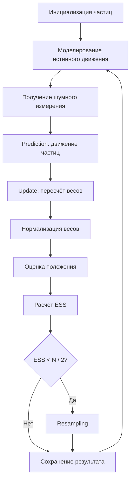

# Particle Filter на C

Небольшой учебный проект, демонстрирующий работу **Particle Filter** — фильтра частиц для оценки положения объекта по шумным измерениям.

Программа моделирует одномерное движение объекта, получает неточные данные от сенсора и с помощью множества частиц постепенно оценивает истинное положение объекта.

## Что делает проект

- моделирует реальное движение объекта в одномерном пространстве;
- добавляет шум движения и шум измерения;
- создаёт набор частиц — гипотез о положении объекта;
- обновляет веса частиц на основе нового измерения;
- нормализует веса;
- вычисляет оценку положения как взвешенное среднее;
- применяет ресэмплинг при вырождении частиц;
- считает ESS, доверительный интервал и RMSE;
- сохраняет результаты симуляции в CSV-файлы.

## Как работает Particle Filter

Фильтр частиц хранит много возможных вариантов положения объекта. Каждый такой вариант называется **частицей**.

На каждом шаге алгоритм выполняет несколько этапов:

1. **Prediction** — частицы сдвигаются по модели движения.
2. **Measurement update** — каждая частица получает вес в зависимости от близости к измерению сенсора.
3. **Normalization** — веса приводятся к сумме 1.
4. **Estimation** — итоговая позиция считается как взвешенное среднее частиц.
5. **Resampling** — если эффективное число частиц становится маленьким, слабые частицы заменяются копиями более вероятных.



## Структура проекта

```text
.
├── Particle.c      # исходный код программы
├── output.csv      # создаётся после запуска: true, measurement, estimate
└── particles.csv   # создаётся после запуска: step, particle position, weight
```

## Требования

Для сборки нужен C-компилятор с поддержкой стандартной библиотеки C и математической библиотеки `math.h`.

Подойдут:

- GCC;
- Clang;
- MinGW на Windows.

## Сборка и запуск

### Linux / macOS

```bash
gcc -Wall -Wextra -std=c11 Particle.c -lm -o particle_filter
./particle_filter
```

### Windows через MinGW

```bash
gcc -Wall -Wextra -std=c11 Particle.c -lm -o particle_filter.exe
particle_filter.exe
```

> Флаг `-lm` нужен для подключения математической библиотеки, потому что в программе используются `sqrt`, `log`, `cos`, `exp` и другие функции из `math.h`.

## Пример вывода

После запуска программа печатает информацию по каждому шагу симуляции:

```text
=== Шаг 0 ===
Истинное: 0.422 | Измерение: -0.497 | Оценка: -0.551
Ошибка: 0.974 | ESS: 181.64 | Ресемплинг: ДА
Доверительный интервал 95%: [-4.43 , 3.36]
Разброс частиц: [-7.04 , 5.48]
```

В конце выводится итоговая ошибка фильтра:

```text
Среднеквадратичная ошибка (RMSE) = 1.2345
```

Так как в симуляции используется случайный шум, конкретные числа при каждом запуске будут отличаться.

## Выходные файлы

### `output.csv`

Файл содержит основные значения по каждому шагу:

```csv
true,measurement,estimate
0.422471,-0.497456,-0.551295
1.861268,-1.950268,-1.001961
2.688552,6.181552,4.697656
```

Поля:

| Поле | Описание |
|---|---|
| `true` | истинное положение объекта |
| `measurement` | измерение сенсора с шумом |
| `estimate` | оценка положения, полученная фильтром частиц |

### `particles.csv`

Файл содержит состояние всех частиц на каждом шаге:

```csv
0,3.053928,0.002000
0,-3.970882,0.002000
0,-1.262968,0.002000
```

Текущий формат файла:

```text
step,x,weight
```

В текущей версии программы заголовок в `particles.csv` не записывается автоматически. Его можно добавить вручную или доработать код:

```c
fprintf(particle_file, "step,x,weight\n");
```

## Основные параметры

В начале файла `Particle.c` заданы главные параметры симуляции:

```c
#define N 500
#define STEPS 50
```

| Параметр | Значение по умолчанию | Описание |
|---|---:|---|
| `N` | `500` | количество частиц |
| `STEPS` | `50` | количество шагов симуляции |
| `velocity` | `1.0` | скорость движения объекта |
| `R` | `4.0` | дисперсия шума измерения |
| `Q` | `1`, `2` или `3` | адаптивная дисперсия шума процесса |

Чем больше частиц, тем обычно точнее оценка, но тем больше вычислений требуется программе.

## Ключевые функции

| Функция | Назначение |
|---|---|
| `init_particles` | создаёт начальное равномерное распределение частиц |
| `predict` | сдвигает частицы по модели движения |
| `update_weights` | пересчитывает веса частиц по измерению |
| `normalize_weights` | нормализует веса так, чтобы их сумма была равна 1 |
| `compute_ess` | считает эффективный размер выборки |
| `resample` | выполняет систематический ресэмплинг |
| `estimate_position` | считает итоговую оценку положения |
| `compute_statistics` | считает среднее, дисперсию, минимум и максимум |
| `confidence_interval` | считает приближённый доверительный интервал |
| `adapt_noise` | адаптирует шум процесса в зависимости от ошибки |
| `save_to_file` | сохраняет `true`, `measurement`, `estimate` в CSV |
| `save_particles` | сохраняет все частицы и их веса |

## Особенности реализации

- Случайные значения с нормальным распределением генерируются через преобразование Бокса — Мюллера.
- Ресэмплинг выполняется систематическим методом.
- Для защиты от численных проблем слишком маленькие веса обрабатываются отдельно.
- Если сумма весов становится практически нулевой, веса сбрасываются к равномерному распределению.
- Доверительный интервал считается приближённо как `mean ± 2 * std`.

## Возможные улучшения

- добавить аргументы командной строки для `N`, `STEPS`, `R` и начального положения;
- добавить заголовок в `particles.csv`;
- сделать фиксированный seed для воспроизводимых запусков;
- добавить Python-скрипт для визуализации `output.csv` и `particles.csv`;
- вынести параметры модели в отдельный конфигурационный файл;
- разделить код на `.h` и `.c` файлы;
- расширить модель с 1D до 2D.

## Идея проекта

Этот проект полезен как учебная демонстрация байесовской фильтрации и стохастического оценивания. Он показывает, как можно оценивать скрытое состояние системы, если прямые измерения неточны и содержат шум.

## Лицензия

Можно использовать как учебный проект. Если планируется публикация на GitHub, рекомендуется добавить файл `LICENSE`, например MIT License.
