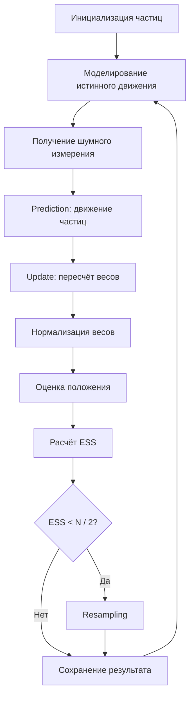

# Particle Filter на C

Небольшой учебный проект, демонстрирующий работу **Particle Filter** — фильтра частиц для оценки положения объекта по шумным измерениям.

Программа моделирует одномерное движение объекта, получает неточные данные от сенсора и с помощью множества частиц постепенно оценивает истинное положение объекта.

## Что делает проект

- моделирует реальное движение объекта в одномерном пространстве;
- добавляет шум движения и шум измерения;
- создаёт набор частиц — гипотез о положении объекта;
- обновляет веса частиц на основе нового измерения;
- нормализует веса;
- вычисляет оценку положения как взвешенное среднее;
- применяет ресэмплинг при вырождении частиц;
- считает ESS, доверительный интервал и RMSE;
- сохраняет результаты симуляции в CSV-файлы.

## Как работает Particle Filter

Фильтр частиц хранит много возможных вариантов положения объекта. Каждый такой вариант называется **частицей**.

На каждом шаге алгоритм выполняет несколько этапов:

1. **Prediction** — частицы сдвигаются по модели движения.
2. **Measurement update** — каждая частица получает вес в зависимости от близости к измерению сенсора.
3. **Normalization** — веса приводятся к сумме 1.
4. **Estimation** — итоговая позиция считается как взвешенное среднее частиц.
5. **Resampling** — если эффективное число частиц становится маленьким, слабые частицы заменяются копиями более вероятных.




## Визуализация результата

Ниже показан пример работы программы после запуска симуляции.

На графике сравниваются три линии:

- **True Position** — истинное положение объекта;
- **Measurement** — шумное измерение сенсора;
- **Estimate (Particle Filter)** — оценка положения, полученная фильтром частиц.

График показывает, что оценка Particle Filter обычно идёт ближе к истинной траектории, чем шумные измерения. Это означает, что фильтр уменьшает влияние случайного шума и даёт более устойчивую оценку положения объекта.


## 3D-визуализация частиц

Дополнительно проект может строить 3D-график распределения частиц во времени.

На графике:

- **Step** — номер шага симуляции;
- **Position** — положение частицы;
- **Normalized Weight** — нормализованный вес частицы от `0` до `1`;
- цвет точки также показывает относительный вес частицы.

Такой график помогает увидеть не только итоговую оценку фильтра, но и внутреннюю работу алгоритма: где находятся частицы, как они концентрируются вокруг вероятного положения объекта и какие частицы получают наибольший вес.


## Коротко о терминах

Ниже — простое объяснение основных слов, которые встречаются в проекте и в выводе программы.

### Частица

**Частица** — это одна гипотеза о том, где может находиться объект.

Например, если истинное положение объекта неизвестно, фильтр не хранит одно число, а хранит много вариантов:

```text
частица 1: x = 0.3
частица 2: x = 1.7
частица 3: x = -0.8
...
```

Чем больше частиц около настоящего положения, тем увереннее фильтр в своей оценке.

### Вес частицы

**Вес** показывает, насколько частица похожа на правду.

Если частица находится близко к измерению сенсора, её вес становится больше. Если далеко — меньше.

Пример:

```text
измерение сенсора: 10.0

частица x = 9.8  -> большой вес
частица x = 10.4 -> большой вес
частица x = 2.0  -> маленький вес
```

После обновления весов программа выполняет **нормализацию**: все веса масштабируются так, чтобы их сумма была равна `1`.

### Шум

**Шум** — это случайная ошибка.

В реальных задачах объект почти никогда не движется идеально, а сенсор почти никогда не измеряет идеально. Поэтому в проекте есть два вида шума:

| Вид шума | Что означает |
|---|---|
| шум процесса | случайная ошибка в движении объекта или частиц |
| шум измерения | ошибка сенсора при измерении положения |

Например, если объект реально находится в точке `10`, сенсор может показать `8.7`, `10.4` или `12.1`.

### Дисперсия

**Дисперсия** показывает, насколько сильно значения разбросаны вокруг среднего.

Маленькая дисперсия означает, что значения находятся близко друг к другу:

```text
9.8, 10.0, 10.1, 10.2
```

Большая дисперсия означает, что значения сильно разбросаны:

```text
3.0, 8.0, 10.0, 15.0, 22.0
```

В этом проекте дисперсия используется для описания силы шума.

```c
double R = 4.0;
```

`R` — это дисперсия шума измерения. Чем больше `R`, тем менее точным считается сенсор.

В коде также используется `Q` — дисперсия шума процесса. Она влияет на то, насколько сильно частицы могут случайно отклоняться при движении.

Важно: стандартное отклонение — это корень из дисперсии.

```text
standard deviation = sqrt(variance)
```

Поэтому если `R = 4.0`, то стандартное отклонение шума измерения равно `sqrt(4.0) = 2.0`.

### Prediction

**Prediction** — шаг предсказания.

На этом этапе фильтр двигает каждую частицу по модели движения:

```text
новая позиция = старая позиция + скорость + случайный шум
```

То есть фильтр предполагает, где частицы окажутся на следующем шаге.

### Measurement update

**Measurement update** — шаг обновления по измерению.

После получения измерения сенсора программа сравнивает каждую частицу с этим измерением. Частицы, которые оказались ближе к измерению, получают больший вес.

Идея простая:

```text
частица близко к измерению -> вес увеличивается
частица далеко от измерения -> вес уменьшается
```

### ESS

**ESS** расшифровывается как **Effective Sample Size**, то есть эффективный размер выборки.

Он показывает, сколько частиц реально полезны.

Например, всего может быть `500` частиц, но если почти весь вес сосредоточен у нескольких частиц, то остальные почти не влияют на результат. В таком случае ESS становится маленьким.

Примерная интерпретация:

| ESS | Что означает |
|---:|---|
| близко к `N` | веса распределены хорошо, много полезных частиц |
| сильно меньше `N` | большая часть частиц почти бесполезна |
| меньше `N / 2` | в этом проекте запускается ресэмплинг |

### Вырождение частиц

**Вырождение частиц** — ситуация, когда большинство частиц имеет почти нулевой вес.

Формально частицы ещё существуют, но практически результат определяют только несколько из них. Это плохо, потому что фильтр теряет разнообразие гипотез.

Именно для борьбы с этим используется ресэмплинг.

### Ресэмплинг

**Ресэмплинг** — это пересборка набора частиц на основе их весов.

Частицы с большими весами с большей вероятностью копируются. Частицы с маленькими весами чаще исчезают.

Упрощённо:

```text
до ресэмплинга:
A: большой вес
B: маленький вес
C: большой вес
D: почти нулевой вес

после ресэмплинга:
A, A, C, C
```

После ресэмплинга веса снова становятся равными:

```text
weight = 1.0 / N
```

В этом проекте используется **систематический ресэмплинг**. Он не выбирает каждую новую частицу полностью независимо, а проходит по распределению весов с равномерным шагом. Такой метод обычно стабильнее простого случайного выбора.

### Оценка положения

**Оценка положения** — итоговый ответ фильтра на вопрос: «где, скорее всего, находится объект?»

Она считается как взвешенное среднее:

```text
estimate = сумма(x частицы * вес частицы)
```

Частицы с большим весом сильнее влияют на итоговую оценку.

### Доверительный интервал

**Доверительный интервал** показывает примерную область, где может находиться объект с учётом разброса частиц.

В проекте он считается приближённо:

```text
mean ± 2 * std
```

где `mean` — среднее положение частиц, а `std` — стандартное отклонение.

Это не строгая математическая гарантия, а удобная учебная оценка неопределённости.

### RMSE

**RMSE** — среднеквадратичная ошибка.

Она показывает, насколько сильно оценка фильтра в среднем отличается от истинного положения объекта.

Меньше RMSE — лучше работа фильтра.

Пример:

```text
истинное положение: 10.0
оценка фильтра:     11.5
ошибка:              1.5
```

RMSE считается по ошибкам за все шаги симуляции.

## Структура проекта

```text
.
├── Particle.c
├── README.md
├── output.csv
├── particles.csv
└── images/
    └── article_filter_visualization.png
```

## Требования

Для сборки нужен C-компилятор с поддержкой стандартной библиотеки C. В программе используются стандартные заголовочные файлы `stdio.h`, `stdlib.h`, `time.h` и математический заголовок `math.h`.

Подойдут:

- GCC;
- Clang;
- MinGW на Windows.

## Сборка и запуск

### Linux / macOS

```bash
gcc -Wall -Wextra -std=c11 Particle.c -lm -o particle_filter
./particle_filter
```

### Windows через MinGW

```bash
gcc -Wall -Wextra -std=c11 Particle.c -lm -o particle_filter.exe
particle_filter.exe
```

> Флаг `-lm` нужен для подключения математической библиотеки при сборке через GCC/Clang, потому что в программе используются `sqrt`, `log`, `cos`, `exp` и другие функции из `math.h`. Заголовки `stdio.h`, `stdlib.h` и `time.h` входят в стандартную библиотеку C и отдельного флага линковки обычно не требуют.

## Пример вывода

После запуска программа печатает информацию по каждому шагу симуляции:

```text
=== Шаг 0 ===
Истинное: 0.422 | Измерение: -0.497 | Оценка: -0.551
Ошибка: 0.974 | ESS: 181.64 | Ресемплинг: ДА
Доверительный интервал 95%: [-4.43 , 3.36]
Разброс частиц: [-7.04 , 5.48]
```

В конце выводится итоговая ошибка фильтра:

```text
Среднеквадратичная ошибка (RMSE) = 1.2345
```

Так как в симуляции используется случайный шум, конкретные числа при каждом запуске будут отличаться.

## Выходные файлы

### `output.csv`

Файл содержит основные значения по каждому шагу:

```csv
true,measurement,estimate
0.422471,-0.497456,-0.551295
1.861268,-1.950268,-1.001961
2.688552,6.181552,4.697656
```

Поля:

| Поле | Описание |
|---|---|
| `true` | истинное положение объекта |
| `measurement` | измерение сенсора с шумом |
| `estimate` | оценка положения, полученная фильтром частиц |

### `particles.csv`

Файл содержит состояние всех частиц на каждом шаге:

```csv
step,x,weight
0,3.053928,0.002000
0,-3.970882,0.002000
0,-1.262968,0.002000
```

## Основные параметры

В начале файла `Particle.c` заданы главные параметры симуляции:

```c
#define N 500
#define STEPS 50
```

| Параметр | Значение по умолчанию | Описание |
|---|---:|---|
| `N` | `500` | количество частиц |
| `STEPS` | `50` | количество шагов симуляции |
| `velocity` | `1.0` | скорость движения объекта |
| `R` | `4.0` | дисперсия шума измерения |
| `Q` | `1`, `2` или `3` | адаптивная дисперсия шума процесса |

Чем больше частиц, тем обычно точнее оценка, но тем больше вычислений требуется программе.

## Ключевые функции

| Функция | Назначение |
|---|---|
| `init_particles` | создаёт начальное равномерное распределение частиц |
| `predict` | сдвигает частицы по модели движения |
| `update_weights` | пересчитывает веса частиц по измерению |
| `normalize_weights` | нормализует веса так, чтобы их сумма была равна 1 |
| `compute_ess` | считает эффективный размер выборки |
| `resample` | выполняет систематический ресэмплинг |
| `estimate_position` | считает итоговую оценку положения |
| `compute_statistics` | считает среднее, дисперсию, минимум и максимум |
| `confidence_interval` | считает приближённый доверительный интервал |
| `adapt_noise` | адаптирует шум процесса в зависимости от ошибки |
| `save_to_file` | сохраняет `true`, `measurement`, `estimate` в CSV |
| `save_particles` | сохраняет все частицы и их веса |

## Особенности реализации

- Случайные значения с нормальным распределением генерируются через преобразование Бокса — Мюллера.
- Ресэмплинг выполняется систематическим методом.
- Для защиты от численных проблем слишком маленькие веса обрабатываются отдельно.
- Если сумма весов становится практически нулевой, веса сбрасываются к равномерному распределению.
- Доверительный интервал считается приближённо как `mean ± 2 * std`.

## Идея проекта

Этот проект полезен как учебная демонстрация байесовской фильтрации и стохастического оценивания. Он показывает, как можно оценивать скрытое состояние системы, если прямые измерения неточны и содержат шум.
